# VetMed Partner

[](LICENSE)


Native App für Tierärztinnen und Tierärzte auf iPhone und Android. Du diktierst die Behandlung, prüfst den Text, lässt einen strukturierten Bericht mit Quellenprüfung erstellen und besprichst Fälle mit einem klinischen KI-Sparringspartner. Fälle bleiben verschlüsselt auf dem Gerät.

> **Kein Medizinprodukt.** VetMed ist ein quelloffener Entwicklungsstand ohne klinische Freigabe. Jeder Bericht ist ein Entwurf und muss fachlich geprüft werden.

## In English

**VetMed** is an open-source (MIT) iOS and Android app for veterinarians:

- **Dictation:** record a consultation and transcribe it on the device.
- **Reports:** turn the transcript into a structured report in which every statement is checked against its source sentence.
- **Clinical sparring partner:** discuss a case as you would with an experienced colleague. It gives weighted differentials (most likely, must-not-miss, which finding would change the decision), suggests next steps and asks critical follow-up questions. Images, lab PDFs and your own case reports can serve as context; quick checks also work without a case.

**Privacy:** Clinical data stays encrypted on the device (SQLCipher, Keychain or Android Keystore). There is no cloud sync. Data leaves the device only when you explicitly start an online report or chat with your own OpenAI API key. Alternatively, reports run fully offline with Gemma 4 E2B (MLX on iOS, LiteRT-LM on Android).

**Quickstart:** iOS needs macOS, Xcode 27 and XcodeGen. Android needs JDK 21 and Android SDK 37.2. Then follow the [step-by-step guide](#schritt-für-schritt-vetmed-selbst-bauen-und-nutzen) below; it is in German, but the shell commands are the same in any language. On iOS, first set your own `DEVELOPMENT_TEAM` and `PRODUCT_BUNDLE_IDENTIFIER` in `apps/ios/project.yml`. The user interface is in German.

**Status and license:** VetMed is not a medical device and has no clinical validation. It is licensed under [MIT](LICENSE); third-party components keep their own licenses, see [THIRD_PARTY.md](THIRD_PARTY.md). Contributions are welcome, see [CONTRIBUTING.md](CONTRIBUTING.md).

## Was VetMed kann

| Funktion | iPhone | Android |
| --- | --- | --- |
| Fälle und Diktat: Aufnehmen, Text prüfen, Bericht | ja | ja |
| Spracherkennung auf dem Gerät (Deutsch) | Apple SpeechAnalyzer | Android On-Device-Erkenner |
| Bericht online mit eigenem OpenAI-Key | ja | ja |
| Bericht offline auf dem Gerät (optional) | Gemma 4 E2B über MLX | Gemma 4 E2B über LiteRT-LM |
| Quellenprüfung (Zahlen, Einheiten, Verneinungen) | ja | ja |
| Klinischer Sparringspartner (online): Differenzialdiagnosen und nächste Schritte, mit Bildern, Labor-PDFs und eigenen Berichten, auch ohne Fall | ja | ja |
| Freigabe, Teilen als Text oder PDF | ja | ja |
| Tag/Nacht und sechs Farbthemen | ja | ja |

Was auf welchem Gerät geprüft ist und was noch offen ist, steht ehrlich im [Prüfstand](docs/test-status.md).

## Screenshots

Alle Bilder zeigen ausschließlich synthetische Testfälle.

### iPhone

Aufgenommen im iOS-Simulator (iPhone 17) bei der Designabnahme am 30.09.2026.

<table>
  <tr>
    <td align="center">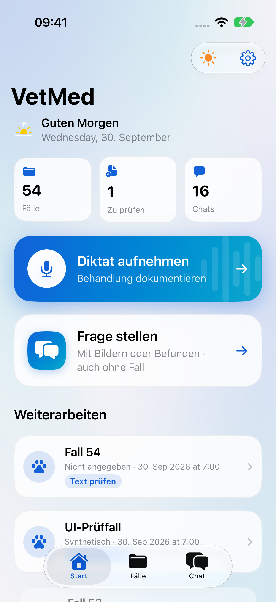<br><sub>Start · Tag</sub></td>
    <td align="center">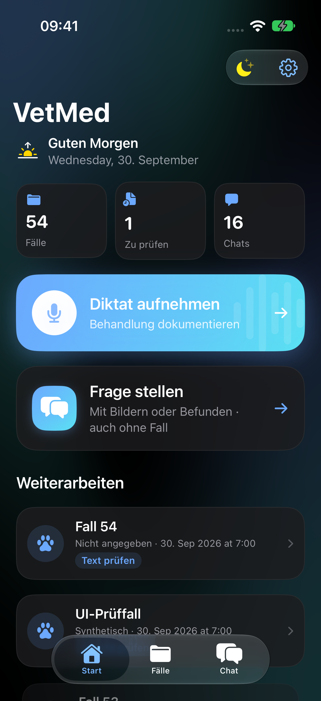<br><sub>Start · Nacht</sub></td>
    <td align="center">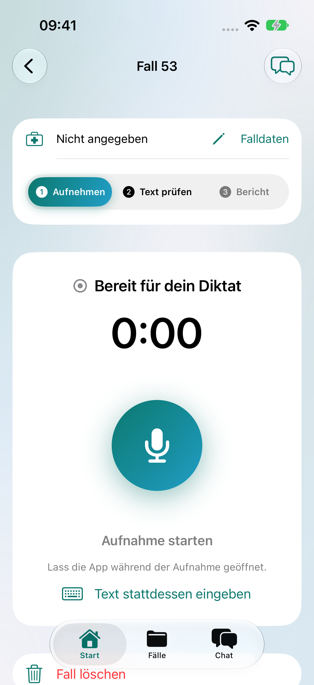<br><sub>Diktat</sub></td>
  </tr>
  <tr>
    <td align="center">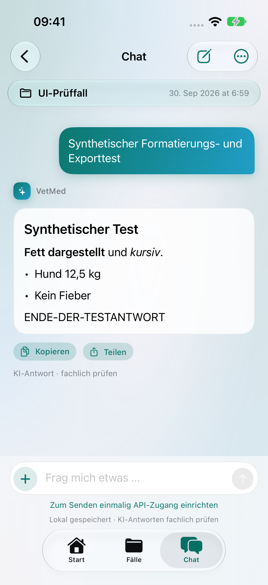<br><sub>Chat</sub></td>
    <td align="center">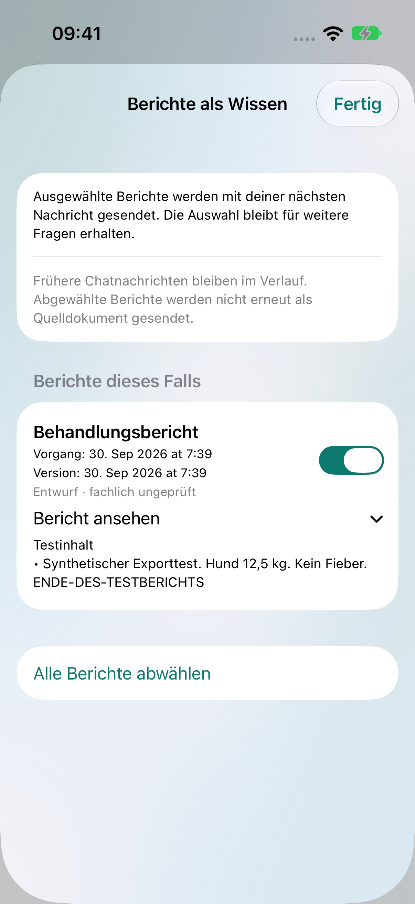<br><sub>Berichte als Wissen im Chat</sub></td>
    <td align="center">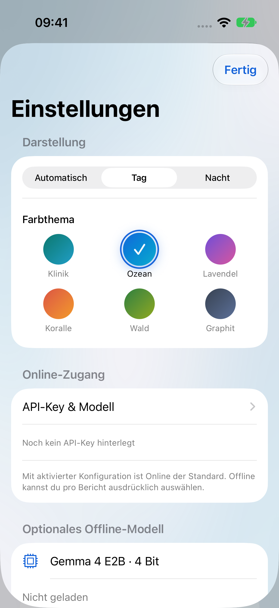<br><sub>Einstellungen · Farbthemen</sub></td>
  </tr>
</table>

### Android

Gerendert aus den Compose-UI-Tests (Robolectric, Bildschirmgröße wie Pixel 9), keine Gerätefotos. Neu erzeugen mit `./scripts/test-android.sh -PrecordScreenshots`.

<table>
  <tr>
    <td align="center">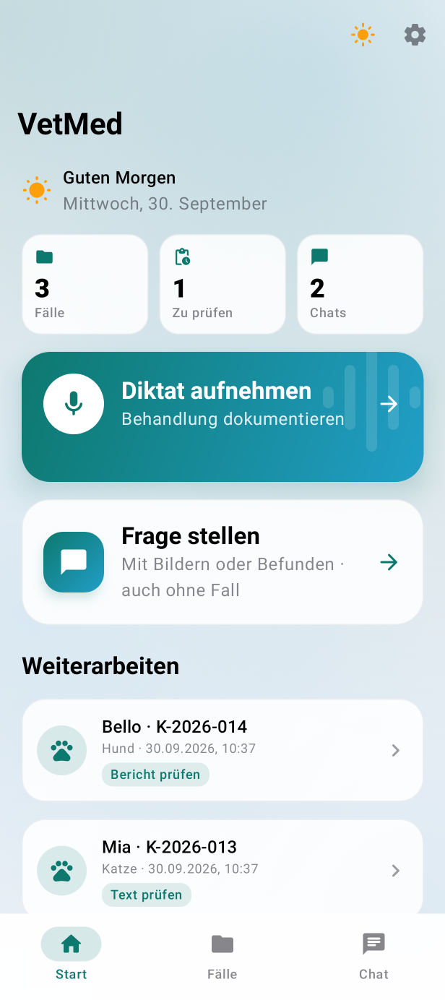<br><sub>Start · Tag · Klinik</sub></td>
    <td align="center">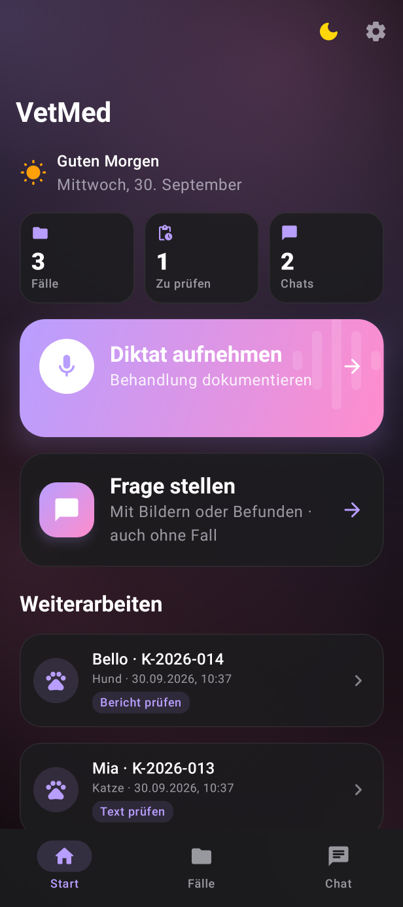<br><sub>Start · Nacht · Lavendel</sub></td>
    <td align="center">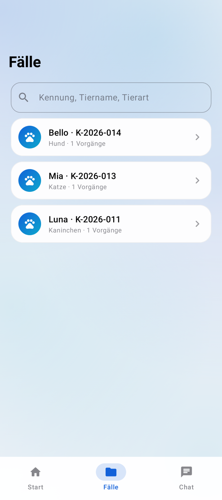<br><sub>Fälle · Ozean</sub></td>
    <td align="center"><br><sub>Fall</sub></td>
  </tr>
  <tr>
    <td align="center">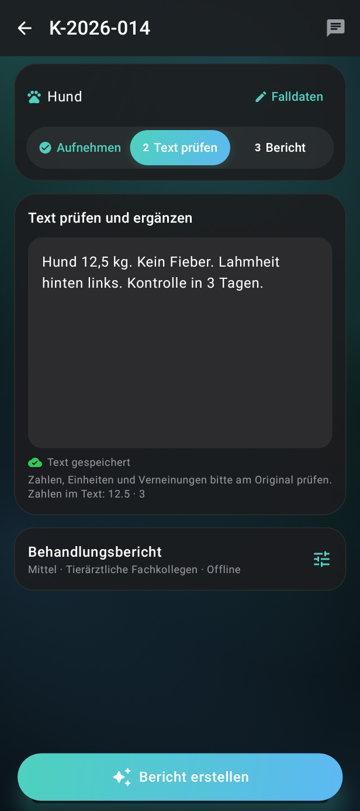<br><sub>Diktat · Text prüfen</sub></td>
    <td align="center">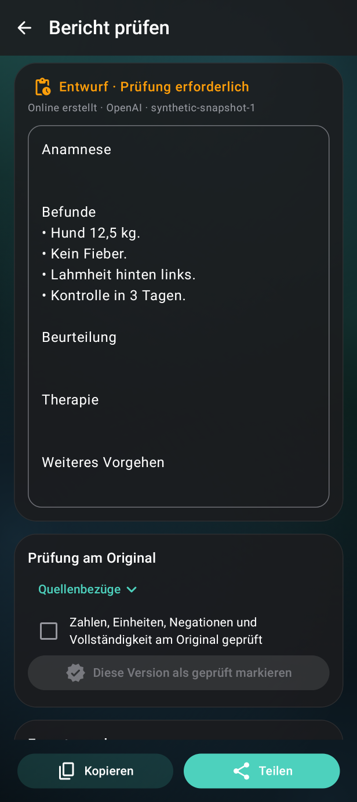<br><sub>Bericht prüfen</sub></td>
    <td align="center">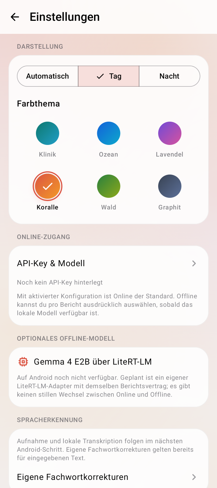<br><sub>Einstellungen · Koralle</sub></td>
    <td align="center">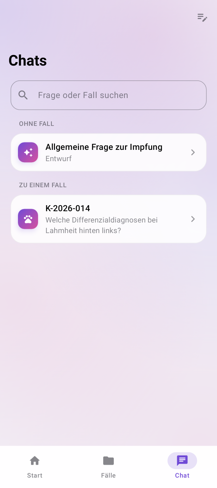<br><sub>Chats · Lavendel</sub></td>
  </tr>
  <tr>
    <td align="center">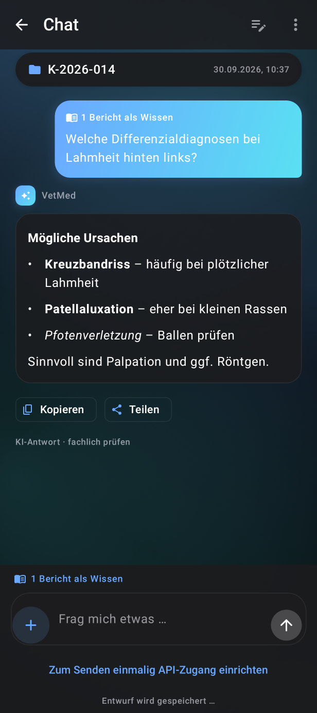<br><sub>Fallchat · Nacht</sub></td>
    <td align="center">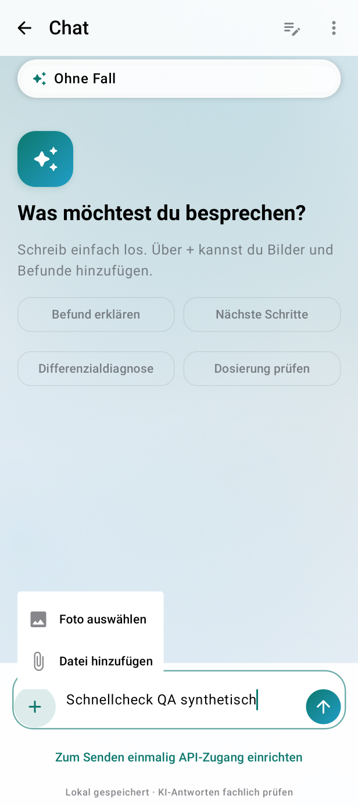<br><sub>Neuer Chat · Anhang</sub></td>
    <td align="center">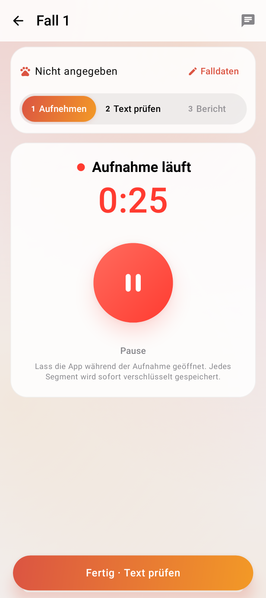<br><sub>Aufnahme läuft</sub></td>
    <td align="center">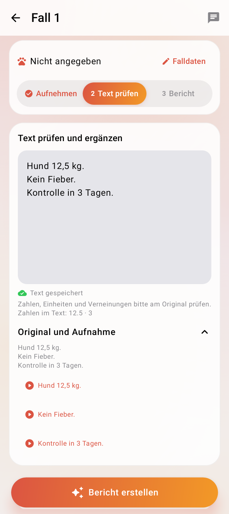<br><sub>Transkript · Original</sub></td>
  </tr>
  <tr>
    <td align="center">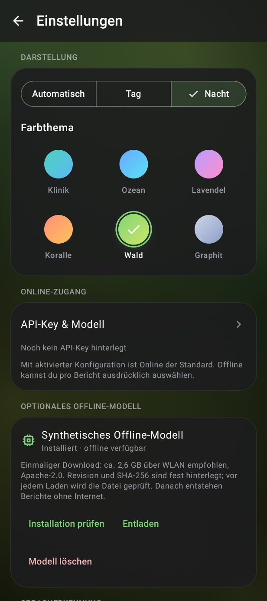<br><sub>Offline-Modell · Wald</sub></td>
    <td></td><td></td><td></td>
  </tr>
</table>

## Schritt für Schritt: VetMed selbst bauen und nutzen

Es gibt keine fertige App im App Store oder Play Store. Du baust VetMed selbst und installierst es auf deinem Gerät. Das dauert beim ersten Mal etwa 30 bis 60 Minuten, das meiste davon sind Downloads.

### A. Was du brauchst

| | iPhone | Android |
| --- | --- | --- |
| Computer | Mac mit macOS und **Xcode 27** | Mac, Windows oder Linux |
| Werkzeuge | [XcodeGen](https://github.com/yonaskolb/XcodeGen) (`brew install xcodegen`), optional [Homebrew](https://brew.sh) | **JDK 21**, Android SDK mit **Plattform 37.2**, einfachste Variante: [Android Studio](https://developer.android.com/studio) |
| Gerät | iPhone mit **iOS 26** oder neuer | Android-Gerät mit **Android 14** oder neuer |
| Konto | kostenloses Apple-Konto reicht, siehe FAQ | keines |
| Für Offline-Berichte | mindestens 8 GB RAM, ca. 3,6 GB frei | mindestens 8 GB RAM, ca. 2,6 GB frei, 64 Bit |
| Für Online-Berichte und Chat | eigener [OpenAI-API-Key](https://platform.openai.com/api-keys) mit Guthaben | ebenso |

Für den ersten Versuch brauchst du weder Key noch Modell. Diktat, Spracherkennung und Texteingabe funktionieren ohne beides.

### B. iPhone

1. **Code holen:**
   ```sh
   git clone https://github.com/tobwil/vetmed-partner.git
   cd vetmed-partner
   ```
2. **Eigenes Signieren eintragen.** Öffne `apps/ios/project.yml` und ändere zwei Zeilen:
   - `DEVELOPMENT_TEAM: 5T32K4L4T4` auf deine Team-ID (10 Zeichen).
     - Mit bezahltem Konto steht sie im [Apple-Developer-Konto](https://developer.apple.com/account) unter Membership.
     - Mit kostenlosem Konto: in Xcode unter Settings → Accounts mit der Apple-ID anmelden und einmal eine beliebige App für dein iPhone signieren lassen. Danach steht die ID in der Schlüsselbundverwaltung im Zertifikat „Apple Development: …“ unter „Organisationseinheit“.
   - `PRODUCT_BUNDLE_IDENTIFIER: de.tobwil.vetmed` auf eine eigene, eindeutige Kennung, z. B. `de.deinname.vetmed`. Die Kennung `de.tobwil.vetmed` ist bereits vergeben.
3. **Xcode-Projekt erzeugen und öffnen:**
   ```sh
   xcodegen generate --spec apps/ios/project.yml
   open apps/ios/VetMed.xcodeproj
   ```
4. **Pakete zulassen.** Xcode lädt beim ersten Öffnen die Swift-Pakete. Fragt Xcode, ob Makros oder Paket-Plugins (MLX, Hugging Face) aktiviert werden dürfen, bestätige mit **Trust & Enable**.
5. **iPhone verbinden**, oben das Schema **VetMed** und dein iPhone als Ziel wählen, dann **Run** (⌘R).
6. **Am iPhone freigeben,** falls nötig:
   - Einstellungen → Datenschutz & Sicherheit → **Entwicklermodus** einschalten. Das iPhone startet danach neu.
   - Beim kostenlosen Konto zusätzlich: Einstellungen → Allgemein → VPN & Geräteverwaltung → dein Entwicklerprofil → **Vertrauen**.
7. **Optional testen:** `./scripts/test-ios.sh` führt alle Unit- und UI-Tests im Simulator aus (Standard: iPhone 17). Ein anderer Simulator lässt sich mit `VETMED_SIM_DESTINATION="platform=iOS Simulator,name=…"` wählen.

### C. Android

1. **Code holen:**
   ```sh
   git clone https://github.com/tobwil/vetmed-partner.git
   cd vetmed-partner
   ```
2. **SDK einrichten.** Am einfachsten mit Android Studio:
   - Öffne den Ordner `apps/android` in Android Studio.
   - Im SDK Manager die Plattform **Android API 37.2** installieren, falls Android Studio nicht selbst danach fragt.
   - Ohne Android Studio: `sdkmanager "platforms;android-37.2" "platform-tools"` und `sdkmanager --licenses`.
   - Dann `apps/android/local.properties` mit dem SDK-Pfad anlegen, z. B. `sdk.dir=/Users/DEIN_NAME/Library/Android/sdk`. Alternativ die Umgebungsvariable `ANDROID_HOME` setzen.
3. **JDK 21 sicherstellen.** `java -version` muss 21 zeigen. Sonst `JAVA_HOME` auf ein JDK 21 setzen, zum Beispiel das in Android Studio mitgelieferte.
4. **Bauen und testen:**
   ```sh
   ./scripts/test-android.sh
   ```
   Das führt Kern- und App-Tests sowie Lint aus und baut die Debug-App.
5. **Gerät vorbereiten:**
   - Einstellungen → Über das Telefon → siebenmal auf **Build-Nummer** tippen.
   - Dann Einstellungen → System → Entwickleroptionen → **USB-Debugging** einschalten.
   - Gerät per USB verbinden und die Abfrage am Gerät erlauben.
6. **Installieren:**
   ```sh
   cd apps/android && ./gradlew :app:installDebug
   ```
   Alternativ in Android Studio auf **Run** klicken.

### D. Erste Einrichtung in der App

1. **App öffnen.** Es gibt keine Anmeldung und keine Face-ID-Abfrage. Die Fälle werden beim ersten Start verschlüsselt angelegt.
2. **Mikrofon erlauben**, wenn die App beim ersten Diktat danach fragt.
3. **Deutsche Spracherkennung:**
   - Unter Einstellungen (Zahnrad auf Start) → Spracherkennung prüfen, ob Deutsch als bereit angezeigt wird.
   - Wenn nicht, auf **Deutsche Sprachressourcen installieren** tippen.
   - Ohne Sprachdaten kannst du den Text auch selbst eingeben oder einfügen.
4. **Optional: Online-Berichte und Chat**
   1. Auf [platform.openai.com/api-keys](https://platform.openai.com/api-keys) einen API-Key anlegen. Dein OpenAI-Konto braucht Guthaben.
   2. In VetMed: Einstellungen → **API-Key & Modell** → Key einfügen → **Modelle laden** (iPhone: „Verfügbare Modelle laden“) → Modell wählen.
   3. **Modell mit synthetischem Text testen.** Dabei wird nur ein fester Testsatz gesendet.
   4. **Online aktivieren.** Ab dann ist Online der Standard für Berichte.
5. **Optional: Offline-Berichte**
   - Einstellungen → Offline-Modell → **Modell herunterladen**. Das sind ca. 3,6 GB auf iOS bzw. 2,6 GB auf Android, am besten im WLAN.
   - Danach im Bericht unter „Anpassen“ **Offline** wählen.
6. **Erstes Diktat:**
   1. Start → **Diktat aufnehmen** → Aufnahme starten.
   2. Sprechen, dann **Fertig · Text prüfen**.
   3. Den erkannten Text korrigieren.
   4. **Bericht erstellen** und jede Aussage am Original prüfen.
   5. Die Version **freigeben**, dann als Text oder PDF **teilen**.

Zum Ausprobieren nur erfundene Fälle verwenden.

### E. Probleme lösen

**Xcode meldet „Signing for VetMed requires a development team“ oder „Failed to register bundle identifier“.**
Team-ID und Bundle-ID aus Schritt B.2 sind noch nicht deine. Ändere beide, führe `xcodegen generate --spec apps/ios/project.yml` erneut aus und baue neu.

**Xcode fragt nach Makros oder Plugins, oder der Build bricht bei MLX ab.**
Die Abfrage mit **Trust & Enable** bestätigen. Für die Kommandozeile nutzt `scripts/test-ios.sh` bereits `-skipPackagePluginValidation -skipMacroValidation`.

**„Developer Mode disabled“ oder „Untrusted Developer“ auf dem iPhone.**
Siehe Schritt B.6.

**Gradle meldet „SDK location not found“.**
`apps/android/local.properties` mit `sdk.dir=…` fehlt, oder `ANDROID_HOME` ist nicht gesetzt (Schritt C.2).

**Gradle meldet einen Fehler zur Java-Version.**
Es läuft ein anderes JDK als 21. `JAVA_HOME` auf ein JDK 21 setzen (Schritt C.3).

**„Deutsche Offline-Spracherkennung ist auf diesem Gerät nicht verfügbar“ (Android).**
Manche Hersteller liefern keinen Offline-Erkenner mit. Die Aufnahme bleibt gespeichert, und du kannst den Text selbst eingeben. Auf Pixel-Geräten ist der Erkenner vorhanden.

**Der Modell-Download bricht ab.**
Erneut auf **Modell herunterladen** tippen. Auf Android setzt der Download an der Abbruchstelle fort. Vor der Nutzung wird die Datei immer per SHA-256 geprüft; eine beschädigte Datei wird nie geladen.

**„Bitte Online-Berichte in Einstellungen … aktivieren“.**
Key, Modell und **Online aktivieren** aus Schritt D.4 fehlen. Oder du wählst für diesen Bericht ausdrücklich **Offline**. VetMed wechselt nie von selbst.

**Für Offline-Berichte fehlt Arbeitsspeicher.**
Gemma braucht ein Gerät mit mindestens 8 GB RAM. Auf kleineren Geräten funktionieren Online-Berichte und der Rest der App weiterhin.

## So funktioniert die App


## FAQ

**Was ist VetMed?**
Eine Arbeitshilfe für Tierärztinnen und Tierärzte: Behandlung diktieren, Text prüfen, daraus einen strukturierten Bericht erstellen lassen und fachliche Fragen im Chat besprechen, mit und ohne Fall. Die App heißt VetMed, das Repository `vetmed-partner`.

**Gibt es VetMed für iPhone und Android?**
Ja, mit gleichem Funktionsumfang. Beide Apps laufen auf echten Geräten: Das iPhone 17 Pro ist ausführlich geprüft, ein Pixel 9a mit einem ersten Gerätetest. Was genau geprüft ist, steht im [Prüfstand](docs/test-status.md). Die Funktionsübersicht steht oben unter [Was VetMed kann](#was-vetmed-kann).

**Was kann der Sparringspartner, und was nicht?**
Du besprichst einen Fall wie mit einer erfahrenen Kollegin, die fachübergreifend denkt (Innere Medizin, Chirurgie, Bildgebung, Labor usw.):
- **Differenzialdiagnosen, gewichtet:** Was passt am ehesten, was ist gefährlich und darf nicht übersehen werden, und welcher Befund würde die Entscheidung ändern?
- **Kritische Nachfragen:** Er hinterfragt Annahmen, statt nur zuzustimmen, und stellt gezielte Rückfragen.
- **Nächste Schritte:** Er schlägt praktikable Untersuchungen und Maßnahmen vor.
- **Kontext:** Fotos, Laborbefunde als PDF (Text wird vorher auf dem Gerät gelesen und von dir bestätigt) und die eigenen Berichte des Falls kannst du einbeziehen. Für einen kurzen Check geht es auch ohne Fall.

Die Grenzen:
- Er stellt keine endgültige Diagnose und ersetzt keine Untersuchung.
- Er erfindet keine Quellen und keine Prozent-Wahrscheinlichkeiten.
- Er behauptet keine eigene Approbation.
- Er läuft nur online mit deinem eigenen OpenAI-Key (`store=false`).
- Jede Antwort ist fachlich zu prüfen.

Die Anweisungen an das Modell sind offen einsehbar: [`shared/prompts/sparring-v1.txt`](shared/prompts/sparring-v1.txt).

**Landen meine Fälle in der Cloud?**
Nein. Fälle, Aufnahmen und Berichte liegen verschlüsselt nur auf dem Gerät. Es gibt keine Synchronisation und kein Backup. Etwas verlässt das Gerät nur, wenn du es ausdrücklich startest: „Bericht online erstellen“ sendet das geprüfte Transkript, „Senden“ im Chat die Frage, die angehängten Inhalte und den Verlauf dieses Chats. Aufnahme und Transkription bleiben lokal.

**Wie sind die Daten geschützt?**
Auf dem iPhone mit SQLCipher und der Dateischutzklasse von iOS; der Schlüssel liegt im Schlüsselbund. Auf Android mit Room und SQLCipher; der Schlüssel ist über den Android Keystore gesichert. API-Keys liegen jeweils getrennt davon. Eine zusätzliche Face-ID-Sperre gibt es auf Wunsch nicht. Wer die App löscht oder das Gerät verliert, verliert auch die Daten.

**Brauche ich einen API-Key, und was kostet das?**
Für Online-Berichte und den Chat brauchst du einen eigenen OpenAI-API-Key. Die Kosten laufen über dein OpenAI-Konto. Der Modelltest in den Einstellungen sendet nur einen festen synthetischen Satz. Anfragen werden mit `store=false` gestellt; was OpenAI darüber hinaus aufbewahrt, regelt dein API-Vertrag.

**Geht es auch ohne Internet?**
Auf dem iPhone optional: Das lokale Modell (Gemma 4 E2B, einmalig ca. 3,6 GB) braucht ein iPhone mit mindestens 8 GB RAM. Es wird nie still als Ersatz genutzt; du wählst Offline ausdrücklich. Ein vollständiger Offline-Lauf mit langem Diktat ist noch nicht erfolgreich abgenommen, siehe [Prüfstand](docs/test-status.md). Auf Android genauso, mit Gemma 4 E2B im LiteRT-LM-Format (einmalig ca. 2,6 GB, mindestens 8 GB RAM). Revision und Prüfsumme sind fest hinterlegt; vor jedem Laden wird die Datei geprüft. Mit echten Gewichten ist das auf Android noch nicht erprobt.

**Was passiert, wenn die Spracherkennung auf meinem Android-Gerät fehlt?**
VetMed nutzt nur den Offline-Erkenner, den Android selbst mitbringt (auf Pixel-Geräten vorhanden, bei anderen Herstellern nicht immer). Fehlen die deutschen Sprachdaten, bietet die App unter Einstellungen → Spracherkennung die Installation an. Ohne sie bleibt die Aufnahme verschlüsselt gespeichert, und du kannst den Text selbst eingeben. Einen Cloud-Erkenner als Ausweichweg gibt es nicht.

**Kann ich einen Bericht direkt verwenden?**
Nein. Jeder Bericht ist ein Entwurf. Die App prüft, dass jede Aussage auf eine Stelle im Diktat verweist und dass Zahlen, Einheiten, Vergleichszeichen und Verneinungen übereinstimmen. Erfundene Werte werden abgewiesen, Abweichungen als Warnung angezeigt. Erst wenn du eine konkrete Version am Original geprüft und freigegeben hast, verschwindet die Entwurfskennzeichnung beim Export.

**Ist VetMed klinisch freigegeben?**
Nein. Es ist ein Entwicklungsstand ohne fachliche Abnahme. Die Testdaten sind synthetisch. Was geprüft ist und was nicht, steht im [Prüfstand](docs/test-status.md).

**Darf ich VetMed nutzen, verändern oder in einem eigenen Produkt verwenden?**
Ja. Der Code steht unter der [MIT-Lizenz](LICENSE). Du darfst ihn nutzen, verändern, weitergeben und auch kommerziell einsetzen, solange der Lizenzhinweis erhalten bleibt. Es gibt keine Gewährleistung. Bibliotheken und Modelle haben eigene Lizenzen, siehe [THIRD_PARTY.md](THIRD_PARTY.md).

**Welche Lizenzen haben Bibliotheken und Modell?**
Fast alles ist Open Source (MIT, Apache-2.0, BSD-artig). Gemma 4 steht unter Apache-2.0 und wird nicht mitgeliefert, sondern auf Wunsch geladen. Einzige Ausnahme ist auf Android die Texterkennung für gescannte PDFs (Google ML Kit): Sie ist kostenlos, aber nicht quelloffen. Details in [THIRD_PARTY.md](THIRD_PARTY.md).

**Ist VetMed ein Medizinprodukt?**
Nein. VetMed hat keine CE-Kennzeichnung, keine Zulassung und keine klinische Validierung. Es ist eine Schreib- und Denkhilfe. Jeder Bericht ist ein Entwurf; die fachliche Verantwortung bleibt bei der Tierärztin oder dem Tierarzt.

**Brauche ich ein kostenpflichtiges Apple-Entwicklerkonto?**
Für dein eigenes iPhone reicht ein kostenloses Apple-Konto in Xcode. Die App läuft dann 7 Tage und muss danach neu aus Xcode installiert werden. Für dauerhafte Installation, TestFlight oder den App Store brauchst du das Apple Developer Program. Für Android brauchst du kein Konto.

**Darf ich echte Fälle in ein Issue schreiben?**
Nein. Bitte nie echte Patientendaten, Namen, Befunde oder API-Keys posten, auch nicht in Screenshots oder Logs. Nutze erfundene Beispiele.

**Wie melde ich Fehler, Sicherheitslücken oder trage etwas bei?**
Fehler und Ideen als [Issue](https://github.com/tobwil/vetmed-partner/issues). Sicherheitslücken bitte privat, siehe [SECURITY.md](SECURITY.md). Wie du Code beiträgst, steht in [CONTRIBUTING.md](CONTRIBUTING.md).

**Wie wechsle ich Tag/Nacht und Farbthema?**
Mit dem Sonne/Mond-Knopf auf Start oder unter Einstellungen → Darstellung (Automatisch, Tag, Nacht und sechs Farbthemen). Auf beiden Plattformen gleich.

**Wo finde ich Entscheidungen und Hintergründe?**
In [docs/architecture](docs/architecture) (eine Datei pro Entscheidung), im [Umsetzungsplan](docs/implementation-plan.md) und im [Projektarchiv](docs/history/README.md).

## Mitmachen, Sicherheit, Lizenz

- **Mitmachen:** [CONTRIBUTING.md](CONTRIBUTING.md). Nur synthetische Daten, keine Keys, keine Modellgewichte.
- **Sicherheitslücken:** privat melden, siehe [SECURITY.md](SECURITY.md).
- **Lizenz:** [MIT](LICENSE) © 2026 tobwil. Bibliotheken und Modelle: [THIRD_PARTY.md](THIRD_PARTY.md).

## Struktur

- `apps/ios`: eigenständiges SwiftUI-Target und Tests.
- `apps/android`: Kotlin-Kern (`core`) und Compose-App (`app`) mit Tests.
- `shared`: versionierte Schemas, Prompts und synthetische Fixtures.
- `docs`: Plan, Herkunft, Architekturentscheidungen, Prüfstand.
- `.reference`: ignorierter rag2go-Checkout; nicht Teil der App und nicht verändert.

Keine produktiven Fallinhalte, API-Schlüssel oder Modellgewichte einchecken. Ohne eigene fachliche und Geräteabnahme keine klinische Freigabe behaupten.

## Projektverlauf

Die App heißt **VetMed**. Der erste GitHub-Stand umfasst den Quellcode samt Entwicklungs-Commits, den vollständigen Umsetzungsplan und ein [Projektarchiv](docs/history/README.md) mit [Gesprächsverlauf](docs/history/conversation-2026-09-29.md), [Chronik](docs/history/project-history.md) und [technischer Übergabe](docs/history/handoff.md). Entscheidungen, fehlgeschlagene Versuche und offene Abnahmen bleiben nachvollziehbar.
